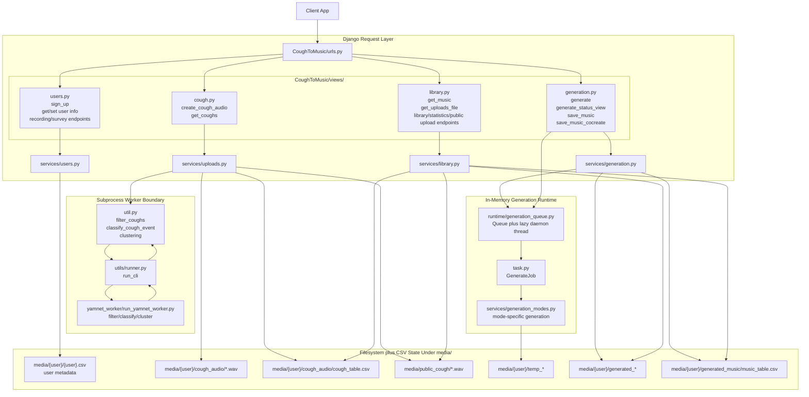
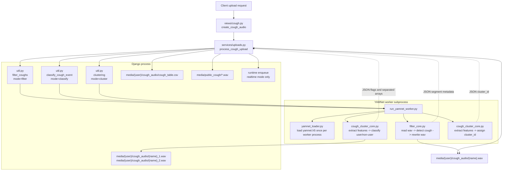

# CoughDjangoServer Diagrams

This file holds the human-oriented system diagrams that were previously embedded in `README.md`.

Use `README.md` for the concise operating model and repo guidance. Use this file when you want a visual map of the request flow and subsystem boundaries.

## System Diagram

Reading the diagram from top to bottom:

- the client talks only to Django endpoints
- routed endpoints now live directly in the modular `views/` modules, with shared filesystem and CSV logic extracted into `services/` where needed
- Django writes durable files and CSVs under `media/`
- filtering, classification, and clustering cross into a separate worker process
- generation is queued in memory and processed by a background runtime worker that starts lazily
- final outputs are moved from temp folders into permanent user folders

## YAMNet Worker Data Flow

## Co-Create Dataflow

```mermaid
flowchart TD
    client["Client"]
    generate_view["views/generation.py<br/>generate"]
    gen_service["services/generation.py<br/>enqueue_generation_request"]
    queue["runtime/generation_queue.py<br/>lazy in-memory queue"]
    job["task.py<br/>GenerateJob.run"]
    modes["services/generation_modes.py<br/>trio / trio_manual / drum / drum_manual"]
    workflows["cocreate/workflows.py<br/>active orchestration"]
    storage["cocreate/storage.py<br/>paths + CSV lookup"]

    subgraph cocreate["CoughToMusic/cocreate/lib"]
        cough2mid["cough2mid.py<br/>cough WAV -> motif MIDI"]
        melody["generation.py<br/>MusicVAE interpolation"]
        drum["drum.py<br/>cough ranking -> drum MIDI"]
        midi["midi.py<br/>normalize/render MIDI -> WAV"]
    end

    subgraph inputs["Read-side inputs"]
        user_wavs["media/{user}/cough_audio/*.wav"]
        cough_csv["media/{user}/cough_audio/cough_table.csv"]
        public_cough["media/public_cough/*.wav"]
        public_motifs["media/public_motif/* and related public motif dirs"]
        models["CoughToMusic/cocreate/model/*"]
        soundfonts["CoughToMusic/cocreate/soundfonts/*"]
    end

    subgraph temp["Temp outputs"]
        temp_trio["media/{user}/temp_trio"]
        temp_manual_trio["media/{user}/temp_manual_trio"]
        temp_manual_drum["media/{user}/temp_manual_drum"]
        temp_autofill_drum["media/{user}/temp_autofill_drum"]
    end

    status["views/generation.py<br/>generate_status_view"]
    save_view["views/generation.py<br/>save_music"]
    save_service["services/generation.py<br/>save_music_result"]
    move["util.py<br/>save_music_move"]

    subgraph final["Finalized outputs"]
        gen_trio["media/{user}/generated_trio"]
        gen_manual_trio["media/{user}/generated_manual_trio"]
        gen_manual_drum["media/{user}/generated_manual_drum"]
        gen_auto_drum["media/{user}/generated_autofill_drum"]
        music_csv["media/{user}/generated_music/music_table.csv"]
    end

    legacy["views/generation.py<br/>save_music_cocreate (compatibility)"]
    cocreate_save["services/generation.py<br/>save_cocreate_result"]
    cocreate_finalize["cocreate/finalize.py<br/>finalize_cocreate_result"]

    client --> generate_view --> gen_service --> queue --> job --> modes --> workflows
    gen_service --> user_wavs
    workflows --> storage
    workflows --> cough_csv
    workflows --> user_wavs
    workflows --> public_cough
    workflows --> public_motifs
    workflows --> cough2mid
    workflows --> melody
    workflows --> drum
    cough2mid --> midi
    melody --> midi
    drum --> midi
    melody --> models
    midi --> soundfonts

    workflows --> temp_trio
    workflows --> temp_manual_trio
    workflows --> temp_manual_drum
    workflows --> temp_autofill_drum

    client --> status
    status --> queue

    client --> save_view --> save_service --> move
    move --> temp_trio
    move --> temp_manual_trio
    move --> temp_manual_drum
    move --> temp_autofill_drum
    move --> gen_trio
    move --> gen_manual_trio
    move --> gen_manual_drum
    move --> gen_auto_drum
    move --> music_csv

    client -. compatibility endpoint .-> legacy
    legacy -. same active finalize contract .-> cocreate_save --> cocreate_finalize
    cocreate_finalize --> gen_trio
    cocreate_finalize --> gen_manual_trio
    cocreate_finalize --> gen_manual_drum
    cocreate_finalize --> gen_auto_drum
    cocreate_finalize --> music_csv
```

