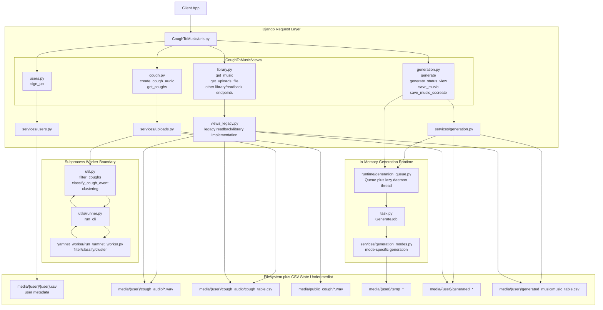
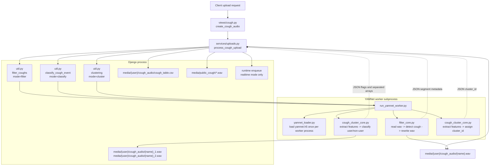

# CoughDjangoServer

`CoughDjangoServer` is a Django backend for recording cough audio, analyzing it, and generating music artifacts from those coughs.

This repo looks like a normal Django project, but the important application state is mostly stored on disk under `media/`, not in `db.sqlite3`.

## Documentation Maintenance

Keep this `README.md` up to date when changes materially affect:

- project purpose or scope
- request/dataflow
- storage model
- runtime setup
- generation modes
- operational caveats

If you change the repo in a way that would mislead a new contributor reading this file, update this file in the same task.

## What It Does

- accepts cough audio uploads from a client
- stores per-user recordings and metadata
- filters, classifies, and clusters cough events
- generates music from cough inputs in several modes
- serves cough and music files back to the client

## High-Level Architecture

Main Django project:

- `CoughToMusicDjango/settings.py`
- `CoughToMusicDjango/urls.py`

Main app:

- `CoughToMusic/urls.py`
- `CoughToMusic/views/`
- `CoughToMusic/services/`
- `CoughToMusic/runtime/`
- `CoughToMusic/cocreate/`
- `CoughToMusic/util.py`
- `CoughToMusic/task.py`
- `CoughToMusic/table.py`
- `CoughToMusic/co_create_utils.py`

Worker boundary:

- `CoughToMusic/utils/runner.py`
- `CoughToMusic/yamnet_worker/run_yamnet_worker.py`

## Dataflow

The main flow is:

1. A client calls `sign_up` to initialize the user folder and CSV files.
2. A client uploads cough audio through `create_cough_audio`.
3. The server writes the uploaded audio to `media/<user>/cough_audio/<name>.wav`.
4. The server filters the cough audio through the YAMNet subprocess worker.
5. The server runs cough classification and clustering through the same worker boundary.
6. The server appends metadata to `cough_table.csv`.
7. If music generation is requested, the controller hands the request to the in-memory runtime queue.
8. The runtime layer lazily starts the background worker and the worker writes temporary generated outputs under the user folder.
9. The client polls `generate_status_view`, which reads runtime job state.
10. The client finalizes output through `save_music` or `save_music_cocreate`.

Mental model:

- HTTP endpoints orchestrate the workflow.
- WAV files and CSV files are the durable state.
- in-memory Python objects track transient generation jobs.
- a subprocess worker handles YAMNet-based filtering, classification, and clustering.
- controller, service, and runtime code are split by responsibility so lightweight imports stay cheap.
- heavy audio and generation libraries are loaded lazily where practical so simple requests and tests do not pay their import cost up front.

## System Diagram



Reading the diagram from top to bottom:

- the client talks only to Django endpoints
- routed views are split between newer `views -> services` flows and a remaining `views -> views_legacy.py` readback/library path
- Django writes durable files and CSVs under `media/`
- filtering, classification, and clustering cross into a separate worker process
- generation is queued in memory and processed by a background runtime worker that starts lazily
- final outputs are moved from temp folders into permanent user folders

## Request Flow By Area

User setup:

- `sign_up` creates user directories and initializes CSV tables.

Upload and analysis:

- `create_cough_audio` saves the audio file early.
- It then filters the saved file through the subprocess worker boundary.
- It calls helper code that classifies cough ownership and computes clustering.
- It may also publish audio into shared public folders.

Generation:

- `generate` normalizes the requested mode and creates a `GenerateJob`.
- The runtime layer lazily starts a single background thread and consumes jobs from an in-memory queue.
- Mode-specific generation is delegated from `CoughToMusic/task.py` into `CoughToMusic/services/generation_modes.py`.
- Co-create modes then flow through `CoughToMusic/cocreate/workflows.py`, with `CoughToMusic/cocreate/storage.py` owning path and CSV lookup concerns.

Readback:

- `get_coughs` now lives directly in `CoughToMusic/views/cough.py`.
- `get_music`, `get_uploads_file`, and several library/statistics endpoints still pass through `CoughToMusic/views/library.py` into `CoughToMusic/views_legacy.py`.

Finalize:

- `save_music` moves temp outputs into permanent per-user folders and appends music metadata.

## YAMNet Worker Data Flow

The YAMNet-based audio analysis in this repo is not hosted as a web service or model server.

Instead:

- Django launches a separate Python process through `run_cli(...)` in `CoughToMusic/utils/runner.py`.
- That subprocess runs `CoughToMusic/yamnet_worker/run_yamnet_worker.py`.
- The worker uses the dedicated interpreter configured by `YAMNET_PYTHON_EXE` in `CoughToMusicDjango/settings.py`.
- Inside the worker, `yamnet_loader.py` lazily loads the model weights from `CoughToMusic/keras_yamnet/yamnet.h5` and caches the model in-process.



The upload-to-worker flow is:

1. `create_cough_audio` calls `process_cough_upload`.
2. `process_cough_upload` writes the uploaded bytes to `media/<user>/cough_audio/<name>.wav`.
3. Django calls `filter_coughs(...)`, which sends a JSON payload with the saved file path to the worker using `mode: "filter"`.
4. The worker reads the WAV from disk, runs noise reduction plus YAMNet-based cough detection, and writes the filtered result back to the same WAV path by default.
5. Django then calls `classify_cough_event(...)` with `mode: "classify"`.
6. The worker loads the saved WAV, extracts YAMNet-derived features around detected cough onsets, and returns whether the audio appears to contain user cough, non-user cough, or both.
7. Django then calls `clustering(...)` with `mode: "cluster"`.
8. The worker compares YAMNet-derived features from the target cough against template coughs and prior user coughs, then returns a `cluster_id`.
9. Django appends the final metadata row to `cough_table.csv` and may also write copies into `media/public_cough/`.

What goes into the worker:

- file paths to WAV files already written under `media/`
- template and user cough directory paths
- the cough CSV path for clustering context
- mode-specific options such as `write_mode`, `sample_rate`, and `strict_mode`

What comes back out of the worker:

- for `filter`: JSON metadata about detected segments, while the main audio output is written back to the WAV on disk
- for `classify`: JSON describing whether user and/or non-user cough content was detected, plus separated waveform arrays for each side
- for `cluster`: a JSON object containing the assigned `cluster_id`

Where the outputs flow next:

- the filtered user upload stays in `media/<user>/cough_audio/`
- `cough_table.csv` is updated with filename, timestamp, coordinates, public cough ID, cluster ID, and `people`
- if classification indicates mixed user/non-user content, Django writes split `_1.wav` and `_2.wav` files back into the same user cough folder
- public copies may be written to `media/public_cough/`
- if the request mode is `realtime`, the saved cough file path is then handed to the in-memory generation queue for music generation

Important operational detail:

- YAMNet is cached only within the lifetime of the worker process started for that subprocess invocation
- this is a local process boundary, not a persistent inference service
- failures here can leave a WAV on disk even if later CSV or classification steps do not complete

## Storage Model

This project is primarily filesystem-backed.

Durable state:

- user folders under `media/<user>/`
- user CSV files such as `<user>.csv`, `cough_table.csv`, and `music_table.csv`
- saved WAV and MIDI artifacts
- shared public assets under `media/public_*`

Not durable:

- queued jobs in memory
- processing/completed job lists in memory

Important implication:

- restarting Django loses job state, but not the files already written to disk

## Important Directories

Shared directories created from settings:

- `media/public_cough/`
- `media/public_music/`
- `media/public_motif/`
- `media/import_cough/`

Common per-user directories:

- `media/<user>/cough_audio/`
- `media/<user>/cough_template/`
- `media/<user>/generated_music/`
- `media/<user>/generated_midi/`
- `media/<user>/generated_trio/`
- `media/<user>/generated_autofill_drum/`
- `media/<user>/generated_manual_trio/`
- `media/<user>/generated_manual_drum/`
- temporary folders such as `temp_music`, `temp_trio`, `temp_manual_trio`, and `temp_autofill_drum`

## Database Reality

`db.sqlite3` exists because this is a Django project, but the main cough-to-music flow does not use the ORM as its primary data store.

In practice:

- Django database tables are mostly framework scaffolding
- the core product state lives in files and CSVs

The model in `CoughToMusic/models.py` is not central to the main runtime flow.

## Running The Project

Standard Django entrypoint:

```powershell
C:\ProgramData\anaconda3\envs\DjangoEnv2\python.exe manage.py runserver
```

Repo helper:

```powershell
.\runserver.ps1
```

## Environment Requirements

This repo appears to depend on two Python environments:

- main Django app environment from `environment.yml`
- YAMNet worker environment from `k_yamnet.yml`

Verified local paths in this repo:

- main app interpreter: `C:\ProgramData\anaconda3\envs\DjangoEnv2\python.exe`
- worker interpreter: `C:\ProgramData\anaconda3\envs\k_yamnet\python.exe`
- `environment.yml` declares the main env name as `DjangoEnv2`
- `CoughToMusicDjango/settings.py` hardcodes `YAMNET_PYTHON_EXE` to the worker env path
- `runserver.ps1` now launches Django with the `DjangoEnv2` interpreter directly

Important Windows caveat:

- this machine resolves bare `python` through a `pyenv` shim that does not point at the Django env
- `conda` is not available on `PATH` in non-initialized shells
- use the full conda env `python.exe` path for `manage.py` commands unless your shell has already been initialized correctly

That means environment setup is still machine-specific and should be verified locally before assuming the project is portable as-is.

## Background Job Model

Generation is asynchronous, but simple:

- an in-memory runtime queue stores jobs
- one daemon thread consumes them
- the runtime starts lazily on first generation use
- job status is kept in memory
- process restarts lose job metadata

This is not a durable queue system like Celery.

## Failure Behavior

The upload and generation flows are not transactional.

Practical consequences:

- if upload processing fails after the WAV is written, the file may remain on disk
- if a later metadata step fails, CSV state can diverge from saved files
- fake cough handling explicitly deletes files in some cases
- generation failures usually do not delete the original uploaded cough file

There is no built-in backup system for uploaded inputs.

## Verification Reality

Automated coverage is still limited, but `CoughToMusic/tests.py` now includes request-level coverage for failed-then-successful upload behavior around the filter wrapper plus focused startup probes for helper imports.

- `test.py` appears stale and references an endpoint that is not currently routed

For most changes, real verification means exercising the relevant HTTP endpoints and inspecting the resulting files and CSV rows.

Upload filtering now has request-level tests that mock the `run_cli(...)` seam to verify one failed upload does not poison the next request in the same Django process. The coverage includes failure on the initial user-file filter call and failure on the later public-copy filter call. The test suite also checks that helper imports do not eagerly load the heavy audio stack or generation helpers.

Verified test command:

```powershell
C:\ProgramData\anaconda3\envs\DjangoEnv2\python.exe manage.py test CoughToMusic.tests
```

The upload tests intentionally create temporary media roots under `media/test_media_<uuid>/` instead of using Python's default `tempfile` directory creation. On this Windows setup, `tempfile`-created directories were not writable for child paths under the Django test process, while normal `os.makedirs(...)` paths under the repo were stable.

## Practical Advice For Contributors

- treat `media/` as the real application datastore
- inspect both file writes and CSV writes when changing behavior
- be careful with path changes and filename conventions
- keep the Django-to-worker subprocess contract stable unless you are intentionally redesigning it
- verify both the API response and the saved artifact path for generation changes

## Co-Create Dataflow

`CoughToMusic/cocreate/` is a library layer, not the HTTP entrypoint.

The active co-create request flow is:

1. The client calls `generate` with `mode` set to `co_create_trio` or `co_create_drum`.
2. `CoughToMusic/services/generation.py` converts the caret-delimited `cough_path` string into real WAV paths under `media/<user>/cough_audio/`.
3. The same service normalizes request mode into one of the runtime job modes: `trio`, `trio_manual`, `drum`, or `drum_manual`.
4. The in-memory runtime queue starts lazily, stores the `GenerateJob`, and runs it on the single worker thread.
5. `CoughToMusic/services/generation_modes.py` dispatches to `CoughToMusic/cocreate/workflows.py`.
6. `workflows.py` uses `CoughToMusic/cocreate/storage.py` for path and CSV lookup, then calls the lower-level `CoughToMusic/cocreate/lib/` modules.
7. The `cocreate/lib/` code reads cough WAVs, shared public cough assets, model checkpoints, and soundfonts, then writes MIDI and rendered WAV artifacts into mode-specific temp folders.
8. The client polls `generate_status_view` and receives the generated temp artifact paths from the in-memory job result.
9. The active finalize path is `save_music`, which moves co-create temp outputs into permanent `generated_*` folders and appends metadata to the standard music table.

The current library split is:

- `cocreate/contracts.py` defines the typed request/result objects for the active workflows.
- `cocreate/storage.py` owns path construction, `cough_table.csv` lookup, and public asset path helpers.
- `cocreate/workflows.py` is the active orchestration layer for trio and drum generation.
- `co_create_utils.py` is legacy compatibility code for older call sites and emits a deprecation warning if `save_final_cocreate` is invoked directly.
- `cocreate/lib/cough2mid.py` turns a cough WAV into short motif MIDI.
- `cocreate/lib/generation.py` interpolates melody or drum material with Magenta/MusicVAE checkpoints under `CoughToMusic/cocreate/model/`.
- `cocreate/lib/drum.py` classifies coughs into drum roles and writes drum MIDI from onset/loudness features.
- `cocreate/lib/midi.py` normalizes MIDI structure and renders MIDI back to WAV using soundfonts.

Mode-specific temp and final folders in the active flow:

- trio: `temp_trio` -> `generated_trio`
- trio manual: `temp_manual_trio` -> `generated_manual_trio`
- drum manual: `temp_manual_drum` -> `generated_manual_drum`
- drum autofill: `temp_autofill_drum` -> `generated_autofill_drum`

Important caveat:

- `save_music` remains the canonical finalize path for generated output.
- `save_music_cocreate` is now a compatibility endpoint that delegates to the same active finalize contract used by `save_music`.
- `co_create_utils.save_final_cocreate` still reflects the older `temp_cocreate` / `generated_music_cocreate` layout, should be treated as legacy compatibility code rather than the active runtime path, and now emits a `DeprecationWarning` when called.

```mermaid
flowchart TD
    client["Client"]
    generate_view["views/generation.py<br/>generate"]
    gen_service["services/generation.py<br/>enqueue_generation_request"]
    queue["runtime/generation_queue.py<br/>lazy in-memory queue"]
    job["task.py<br/>GenerateJob.run"]
    modes["services/generation_modes.py<br/>trio / trio_manual / drum / drum_manual"]
    workflows["cocreate/workflows.py<br/>active orchestration"]
    storage["cocreate/storage.py<br/>paths + CSV lookup"]

    subgraph cocreate["CoughToMusic/cocreate/lib"]
        cough2mid["cough2mid.py<br/>cough WAV -> motif MIDI"]
        melody["generation.py<br/>MusicVAE interpolation"]
        drum["drum.py<br/>cough ranking -> drum MIDI"]
        midi["midi.py<br/>normalize/render MIDI -> WAV"]
    end

    subgraph inputs["Read-side inputs"]
        user_wavs["media/{user}/cough_audio/*.wav"]
        cough_csv["media/{user}/cough_audio/cough_table.csv"]
        public_cough["media/public_cough/*.wav"]
        public_motifs["media/public_motif/* and related public motif dirs"]
        models["CoughToMusic/cocreate/model/*"]
        soundfonts["CoughToMusic/cocreate/soundfonts/*"]
    end

    subgraph temp["Temp outputs"]
        temp_trio["media/{user}/temp_trio"]
        temp_manual_trio["media/{user}/temp_manual_trio"]
        temp_manual_drum["media/{user}/temp_manual_drum"]
        temp_autofill_drum["media/{user}/temp_autofill_drum"]
    end

    status["views/generation.py<br/>generate_status_view"]
    save_view["views/generation.py<br/>save_music"]
    save_service["services/generation.py<br/>save_music_result"]
    move["util.py<br/>save_music_move"]

    subgraph final["Finalized outputs"]
        gen_trio["media/{user}/generated_trio"]
        gen_manual_trio["media/{user}/generated_manual_trio"]
        gen_manual_drum["media/{user}/generated_manual_drum"]
        gen_auto_drum["media/{user}/generated_autofill_drum"]
        music_csv["media/{user}/generated_music/music_table.csv"]
    end

    legacy["views/generation.py<br/>save_music_cocreate (compatibility)"]
    legacy_save["co_create_utils.py<br/>legacy save_final_cocreate"]

    client --> generate_view --> gen_service --> queue --> job --> modes --> workflows
    gen_service --> user_wavs
    workflows --> storage
    workflows --> cough_csv
    workflows --> user_wavs
    workflows --> public_cough
    workflows --> public_motifs
    workflows --> cough2mid
    workflows --> melody
    workflows --> drum
    cough2mid --> midi
    melody --> midi
    drum --> midi
    melody --> models
    midi --> soundfonts

    workflows --> temp_trio
    workflows --> temp_manual_trio
    workflows --> temp_manual_drum
    workflows --> temp_autofill_drum

    client --> status
    status --> queue

    client --> save_view --> save_service --> move
    move --> temp_trio
    move --> temp_manual_trio
    move --> temp_manual_drum
    move --> temp_autofill_drum
    move --> gen_trio
    move --> gen_manual_trio
    move --> gen_manual_drum
    move --> gen_auto_drum
    move --> music_csv

    client -. compatibility endpoint .-> legacy
    legacy -. legacy helper remains in repo .-> legacy_save
```


